# Architecture & Fonctionnement de la base Supabase

Ce document détaille l'organisation, le schéma physique, les règles d'accès de sécurité (Row Level Security) et les mécanismes d'automatisation (fonctions et déclencheurs) de la base de données **Supabase (PostgreSQL 17)** de SportTrack.

---

## 1. Vue d'ensemble de la base
La base de données est structurée pour isoler hermétiquement les données personnelles de chaque utilisateur par défaut, tout en permettant des relations de groupe et de coaching (où les coachs peuvent consulter et administrer les plans d'entraînement de leurs athlètes).

- **Schéma principal** : `public`
- **Authentification** : Gérée par `auth.users` via Supabase Auth
- **Sécurité** : RLS (Row Level Security) actif sur toutes les tables de données utilisateurs.

---

## 2. Dictionnaire des Tables

```mermaid
erDiagram
    users ||--|| profiles : "possede (id)"
    users ||--|| athlete_profiles : "defini (user_id)"
    users ||--o{ provider_connections : "etablit (user_id)"
    users ||--o{ activities : "realise (user_id)"
    users ||--o{ daily_metrics : "enregistre (user_id)"
    users ||--o{ hr_zones : "calcule (user_id)"
    users ||--o{ planned_sessions : "planifie (user_id)"
    users ||--o{ risk_assessments : "evalue (user_id)"
    users ||--o{ injuries : "declare (user_id)"
    users ||--o{ training_blocks : "organise (user_id)"
    users ||--o{ training_goals : "vise (user_id)"
    users ||--o{ group_members : "membre (user_id)"
    groups ||--o{ group_members : "comprend (group_id)"
    groups ||--o{ group_planned_sessions : "planifie (group_id)"
    groups ||--o{ group_training_blocks : "cadre (group_id)"
```



### Table: `profiles`
Stocke les informations publiques et l'état administratif des utilisateurs. Liée directement à Supabase Auth.
* **`id`** (`uuid`, PK) : Identifiant unique, référence `auth.users(id)` en cascade.
* **`email`** (`text`, unique, non null) : Adresse email de l'utilisateur.
* **`display_name`** (`text`) : Nom d'affichage de l'utilisateur.
* **`avatar_url`** (`text`) : Lien vers l'image de profil.
* **`is_admin`** (`boolean`, default `false`) : Drapeau désignant si l'utilisateur est administrateur.
* **`created_at`** (`timestamptz`, default `now()`) : Date de création du profil.
* **`updated_at`** (`timestamptz`, default `now()`) : Date de dernière mise à jour.

### Table: `athlete_profiles`
Données physiologiques et préférences sportives de l'athlète.
* **`id`** (`uuid`, PK) : Clé primaire par défaut (`gen_random_uuid()`).
* **`user_id`** (`uuid`, unique) : Référence `auth.users(id)` en cascade.
* **`first_name`** / **`last_name`** (`text`) : Prénom et nom de famille.
* **`birth_date`** (`date`) : Date de naissance.
* **`gender`** (`text`) : Genre (`'male'`, `'female'`, `'other'`, `'prefer_not_to_say'`).
* **`height_cm`** (`numeric(5,1)`) / **`weight_kg`** (`numeric(5,1)`) : Taille et poids.
* **`hr_max`** (`int`) : Fréquence cardiaque maximale (entre 100 et 230).
* **`hr_rest`** (`int`) : Fréquence cardiaque de repos (entre 30 and 100).
* **`vma_kmh`** (`numeric(4,1)`) : Vitesse Maximale Aérobie.
* **`ftp_watts`** (`int`) : Functional Threshold Power (cyclisme).
* **`css_pace_per_100m`** (`text`) : Critical Swim Speed (allure/100m).
* **`primary_sport`** (`text`) : Sport principal pratiqué.
* **`practiced_sports`** (`jsonb`, default `'[]'`) : Liste des sports pratiqués.
* **`training_years`** (`int`) : Années d'expérience d'entraînement.
* **`weekly_target_hours`** (`numeric(4,1)`) : Objectif d'heures d'entraînement hebdomadaire.

### Table: `hr_zones`
Zones de fréquence cardiaque individuelles basées sur la FC max.
* **`id`** (`uuid`, PK)
* **`user_id`** (`uuid`) : Référence `auth.users(id)` en cascade.
* **`zone_number`** (`int`) : Numéro de zone (de 1 à 5).
* **`zone_name`** (`text`) : Nom de la zone (ex: endurance fondamentale).
* **`hr_min`** (`int`) / **`hr_max`** (`int`) : Seuils absolus de pulsations (bpm).
* **`pct_min`** (`numeric`) / **`pct_max`** (`numeric`) : Pourcentages correspondants de la FC max.
* **`is_custom`** (`boolean`, default `false`) : Indique si la zone a été manuellement éditée.
* **`color_hex`** (`text`) : Couleur hexadécimale associée à la zone pour l'affichage graphique.
* *Contrainte unique* : `(user_id, zone_number)`

### Table: `provider_connections`
Connexions actives aux plateformes et wearables partenaires (OAuth tokens).
* **`id`** (`uuid`, PK)
* **`user_id`** (`uuid`) : Référence `auth.users(id)` en cascade.
* **`provider`** (`text`) : Nom du fournisseur (`'strava'`, `'terra'`, `'garmin'`).
* **`provider_user_id`** (`text`) : Identifiant chez le fournisseur.
* **`access_token`** (`text`) / **`refresh_token`** (`text`) : Jetons OAuth.
* **`token_expires_at`** (`bigint`) : Timestamp d'expiration (en secondes).
* **`scopes`** (`text[]`) : Permissions accordées.
* **`is_active`** (`boolean`, default `true`) : État de la connexion.
* **`last_sync_at`** (`timestamptz`) : Horodatage de la dernière synchronisation réussie.
* *Contrainte unique* : `(user_id, provider)`

### Table: `activities`
Séances d'entraînement réalisées, importées ou créées manuellement.
* **`id`** (`uuid`, PK)
* **`user_id`** (`uuid`) : Référence `auth.users(id)` en cascade.
* **`provider`** (`text`) : Provenance de l'activité (`'strava'`, `'manual'`, etc.).
* **`provider_activity_id`** (`text`) : Identifiant unique chez le fournisseur.
* **`name`** (`text`) : Nom de l'activité.
* **`sport_type`** (`text`) : Type de sport (ex: `'Run'`, `'Ride'`, etc.).
* **`start_date`** (`timestamptz`) : Date et heure de début de séance.
* **`timezone`** (`text`) : Fuseau horaire.
* **`duration_sec`** (`int`) / **`moving_time_sec`** (`int`) : Durées totale et en mouvement.
* **`distance_m`** (`numeric`) / **`elevation_gain_m`** (`numeric`) : Distance (mètres) et dénivelé positif (mètres).
* **`average_speed`** / **`max_speed`** (`numeric`) : Vitesses moyennes et max (m/s).
* **`average_heartrate`** / **`max_heartrate`** (`int`) : Fréquence cardiaque moyenne et max.
* **`average_cadence`** / **`average_power`** / **`calories`** (`int`) : Métriques d'effort et dépense énergétique.
* **`raw_data_json`** (`jsonb`) : Données brutes reçues du fournisseur.
* **`source`** (`text`, default `'strava'`) : Source primaire.
* **`rpe`** (`int`) : Effort perçu subjectif (échelle de Borg 1-10).
* **`feel_score`** (`int`) : Ressenti général (1-5).
* **`motivation_score`** / **`perceived_recovery`** (`int`) : Niveau de motivation et qualité de récupération (1-5).
* **`post_session_notes`** (`text`) : Commentaires textuels.
* **`body_feeling_tags`** / **`context_tags`** / **`session_quality_tags`** (`jsonb`, default `'[]'`) : Mots-clés qualitatifs (ex: douleurs, météo, etc.).
* **`temperature_c`** (`numeric`) / **`weather_condition`** (`text`) : Conditions environnementales.
* **`time_in_zones_json`** (`jsonb`) : Temps cumulé par zone FC en secondes (ex: `{"1": 120, "2": 2400}`).
* *Contrainte unique* : `(user_id, provider, provider_activity_id)`

### Table: `daily_metrics`
Données journalières physiologiques et agrégats d'activité.
* **`id`** (`uuid`, PK)
* **`user_id`** (`uuid`) : Référence `auth.users(id)` en cascade.
* **`metric_date`** (`date`) : Jour concerné.
* **`sessions_count`** (`int`, default `0`) : Nombre de séances effectuées dans la journée.
* **`duration_sec`** (`int`, default `0`) / **`distance_m`** (`numeric`, default `0`) / **`elevation_gain_m`** (`numeric`, default `0`) : Totaux de la journée.
* **`training_load`** (`numeric`, default `0`) : Charge cumulée calculée pour ce jour (base CTL/ATL).
* **`resting_hr`** (`int`) : Fréquence cardiaque de repos enregistrée (Garmin / Terra).
* **`hrv_rmssd`** (`numeric`) : Variabilité de la fréquence cardiaque (HRV) en ms.
* **`hrv_status`** (`text`) : État de la HRV (`'balanced'`, `'low'`, `'unbalanced'`, `'poor'`, `'no_status'`).
* **`sleep_score`** (`int`) : Score global de sommeil (0-100).
* **`sleep_duration_min`** / **`sleep_deep_min`** / **`sleep_rem_min`** / **`sleep_light_min`** / **`sleep_awake_min`** (`int`) : Distribution des phases de sommeil.
* **`body_battery_morning`** / **`body_battery_evening`** (`int`) : Niveaux d'énergie (0-100).
* **`training_readiness`** (`int`) : Niveau de préparation à l'entraînement (0-100).
* **`stress_score_avg`** (`int`) : Niveau de stress moyen de la journée (0-100).
* **`spo2_avg`** / **`respiration_avg`** / **`vo2max_estimated`** (`numeric`) : Autres métriques de santé.
* *Contrainte unique* : `(user_id, metric_date)`

### Table: `planned_sessions`
Plan d'entraînement prospectif.
* **`id`** (`uuid`, PK)
* **`user_id`** (`uuid`) : Référence `auth.users(id)` en cascade.
* **`planned_date`** (`date`) : Date planifiée.
* **`planned_time`** (`time`) : Heure cible.
* **`sport_type`** / **`session_type`** (`text`) : Type de sport et de séance (ex: `'intervals'`, `'easy'`).
* **`planned_duration_min`** (`int`) / **`planned_distance_km`** (`numeric`) : Volume visé.
* **`planned_load`** (`int`) : Intensité/charge estimée.
* **`description`** (`text`) : Consignes et contenu de séance.
* **`target_zones`** (`int[]`) : Zones d'intensité cibles (ex: `{2, 4}`).
* **`status`** (`text`, default `'planned'`) : État (`'planned'`, `'completed'`, `'skipped'`, `'modified'`).
* **`actual_activity_id`** (`uuid`) : Activité réelle associée (référence `activities(id)`).
* **`completion_score`** (`numeric`) : Score d'accomplissement (ex: pourcentage de la durée cible réalisée).
* **`group_planned_session_id`** (`uuid`) : Référence la séance mère si planifiée au niveau d'un groupe (`group_planned_sessions(id)`).

### Table: `risk_assessments`
Résultats d'évaluation quotidienne du risque de surentraînement.
* **`id`** (`uuid`, PK)
* **`user_id`** (`uuid`) : Référence `auth.users(id)` en cascade.
* **`assessment_date`** (`date`) : Date d'évaluation.
* **`score`** (`int`) : Niveau de risque sur une échelle de 0 à 10.
* **`level`** (`text`) : Niveau qualitatif (`'none'`, `'low'`, `'moderate'`, `'high'`, `'critical'`).
* **`reasons`** (`jsonb`) : Liste textuelle des facteurs de risques relevés (ex: ACWR élevé, sommeil dégradé, HRV basse).
* *Contrainte unique* : `(user_id, assessment_date)`

### Table: `injuries`
Registre des blessures déclarées par l'utilisateur.
* **`id`** (`uuid`, PK)
* **`user_id`** (`uuid`) : Référence `auth.users(id)` en cascade.
* **`body_zone`** (`text`) : Zone corporelle touchée (ex: `'Genou gauche'`).
* **`injury_type`** (`text`) : Nature de la blessure (`'muscular'`, `'tendinous'`, `'bone'`, `'ligament'`, `'other'`).
* **`severity`** (`int`) : Gravité (1 = légère, 2 = modérée, 3 = sévère).
* **`start_date`** (`date`) / **`end_date`** (`date`) : Dates de début et de fin (guérison).
* **`description`** / **`treatment`** (`text`) : Détail des symptômes et protocole de soin.
* **`related_activity_id`** (`uuid`) : Référence l'activité déclencheuse (`activities(id)`).

### Table: `training_blocks`
Découpage de la saison en blocs de travail (ex: Foncier, Pré-compétition).
* **`id`** (`uuid`, PK)
* **`user_id`** (`uuid`) : Référence `auth.users(id)` en cascade.
* **`name`** (`text`) : Nom du bloc.
* **`start_date`** (`date`) / **`end_date`** (`date`) : Période du bloc (contrainte : début $\le$ fin).
* **`group_training_block_id`** (`uuid`) : Référence le bloc parent de groupe si applicable (`group_training_blocks(id)`).

### Table: `training_goals`
Objectifs d'entraînement à court ou long terme.
* **`id`** (`uuid`, PK)
* **`user_id`** (`uuid`) : Référence `auth.users(id)` en cascade.
* **`type`** (`text`) : Type d'objectif (`'race'`, `'weekly_volume'`, `'weekly_workouts'`).
* **`name`** (`text`) : Description de l'objectif (ex: "Semi de Paris").
* **`target_date`** (`date`) : Date d'échéance.
* **`target_value`** (`numeric`) : Valeur chiffrée (ex: distance de course en km, volume en heures).

---

### Tables de Groupes & Coaching

Ces tables orchestrent les relations multi-utilisateurs et le partage des données.

### Table: `groups`
Clubs ou groupes de préparation collective d'objectifs.
* **`id`** (`uuid`, PK)
* **`name`** (`text`) : Nom du groupe.
* **`description`** (`text`) : Présentation du groupe.
* **`target_event_name`** (`text`) : Nom de l'événement cible commun.
* **`target_event_date`** (`date`) : Date de l'événement.
* **`target_distance_km`** (`numeric`) : Distance visée de l'événement.
* **`invite_code`** (`text`, unique) : Code unique de partage pour s'inscrire au groupe.
* **`created_by`** (`uuid`) : Référence le créateur du groupe (`auth.users(id)`).

### Table: `group_members`
Association des membres d'un groupe avec leurs rôles.
* **`group_id`** (`uuid`) : Référence `groups(id)` en cascade.
* **`user_id`** (`uuid`) : Référence `auth.users(id)` en cascade.
* **`role`** (`text`) : Rôle (`'admin'`, `'coach'`, `'athlete'`).
* **`target_time_sec`** (`int`) : Objectif chronométrique personnel sur l'événement en secondes.
* *Clé primaire composée* : `(group_id, user_id)`

### Table: `group_planned_sessions`
Séances planifiées collectivement par le coach ou l'administrateur du groupe.
* **`id`** (`uuid`, PK)
* **`group_id`** (`uuid`) : Référence `groups(id)` en cascade.
* **`planned_date`** (`date`) / **`planned_time`** (`time`) : Calendrier de la séance.
* **`sport_type`** / **`session_type`** (`text`) : Type de sport et nature de séance.
* **`planned_duration_min`** (`int`) / **`planned_distance_km`** (`numeric`) : Intensité ciblée.
* **`description`** (`text`) : Contenu détaillé de la séance commune.
* **`created_by`** (`uuid`) : Référence le créateur (`auth.users(id)`).

### Table: `group_training_blocks`
Périodes de travail communes au sein du groupe (ex: "Semaine de décharge").
* **`id`** (`uuid`, PK)
* **`group_id`** (`uuid`) : Référence `groups(id)` en cascade.
* **`name`** (`text`) : Nom du bloc de groupe.
* **`start_date`** (`date`) / **`end_date`** (`date`) : Période temporelle.
* **`created_by`** (`uuid`) : Référence le créateur (`auth.users(id)`).

---

### Tables Système (Configuration & Secrets)

Ces tables n'activent pas de RLS régulier et sont accédées uniquement via la clé `service_role`.

- **`strava_config`** : Contient les secrets API de l'application cliente Strava.
- **`terra_config`** : Contient les identifiants d'accès développeur à l'API Terra.
- **`garmin_credentials`** : Contient les informations de connexion chiffrées des utilisateurs Garmin Connect (`email`, `password` et le dump JSON des jetons de session `token_data`).

---

## 3. Modèle de Sécurité (Row Level Security)

Toutes les données personnelles sont protégées en base par des politiques **RLS (Row Level Security)** Postgres.

### Règle d'Isolation Standard
Pour toutes les données physiologiques, historiques et les blessures de l'utilisateur, l'accès direct est restreint au propriétaire légitime :
```sql
CREATE POLICY "user_access_own" ON public.table
  FOR ALL USING (auth.uid() = user_id);
```

### Logique d'accès étendu pour les Groupes
Afin d'encourager la collaboration, dès qu'un utilisateur rejoint un **groupe**, il partage automatiquement son profil et son historique d'activités avec les autres membres de son groupe.
- **Sélection des profils membres** :
  ```sql
  CREATE POLICY "profiles_select_group_members" ON public.profiles
    FOR SELECT USING (public.shares_group(id, auth.uid()));
  ```
- **Sélection des activités membres** :
  ```sql
  CREATE POLICY "activities_select_group_members" ON public.activities
    FOR SELECT USING (public.shares_group(user_id, auth.uid()));
  ```

### Logique d'accès étendu pour le Coaching (Droits du Coach)
Les utilisateurs ayant le rôle de **coach** dans un groupe partagé bénéficient d'un accès étendu en lecture et en écriture sur les données des athlètes membres du groupe.
- **Lecture des données athlètes** : Permet aux coachs de voir les indicateurs clés (`daily_metrics`, `training_goals`, `injuries`, `training_blocks`).
  ```sql
  CREATE POLICY "coach_select_metrics" ON public.daily_metrics
    FOR SELECT USING (public.is_coach_of_athlete(auth.uid(), user_id));
  ```
- **Lecture et Modification de la Planification** : Permet aux coachs d'éditer le calendrier et les blocs d'entraînement des athlètes.
  ```sql
  CREATE POLICY "coach_all_planned" ON public.planned_sessions
    FOR ALL USING (public.is_coach_of_athlete(auth.uid(), user_id))
    WITH CHECK (public.is_coach_of_athlete(auth.uid(), user_id));
  ```

---

## 4. Fonctions Stockées & Triggers

La logique métier distribuée s'exécute directement dans Postgres via des triggers associés à des fonctions définies en `plpgsql`. Toutes ces fonctions s'exécutent en mode `SECURITY DEFINER` pour outrepasser les récursions et limitations de RLS lors de calculs transverses.

### `handle_new_user()`
* **Déclencheur** : `AFTER INSERT ON auth.users`
* **Comportement** : Crée automatiquement une ligne correspondante dans la table `public.profiles` lors de la création d'un compte utilisateur en extrayant son email et son nom.

### `match_planned_to_actual()`
* **Déclencheur** : `AFTER INSERT ON public.activities`
* **Comportement** : Tente de réconcilier une activité réelle insérée avec une séance planifiée le même jour pour le même sport. Si une correspondance est trouvée, met à jour le statut de la séance à `'completed'` et calcule le `completion_score`.

### `propagate_group_session()`
* **Déclencheur** : `AFTER INSERT ON public.group_planned_sessions`
* **Comportement** : Duplique et insère individuellement la séance programmée collectivement dans la table `planned_sessions` de chaque membre du groupe (qui n'a pas le rôle de coach).

### `sync_group_session_updates()`
* **Déclencheur** : `AFTER UPDATE ON public.group_planned_sessions`
* **Comportement** : Met à jour toutes les séances individuelles générées correspondantes qui ont encore le statut `'planned'`.

### `propagate_group_training_block()`
* **Déclencheur** : `AFTER INSERT ON public.group_training_blocks`
* **Comportement** : Crée un bloc de préparation individuelle dans la table `training_blocks` pour chaque athlète membre du groupe.

### `sync_group_training_block_updates()`
* **Déclencheur** : `AFTER UPDATE ON public.group_training_blocks`
* **Comportement** : Synchronise les dates et noms de blocs sur les blocs d'entraînements individuels propagés.

---

## 5. Indexation pour la Performance

Des index composites ont été créés pour optimiser les requêtes fréquentes de sélection temporelle :

* **`idx_athlete_profiles_user_id`** : Accélère le chargement du profil lors de l'onboarding/dashboard.
* **`idx_hr_zones_user_id`** : Accélère la récupération des zones d'intensité lors de l'affichage ou du calcul cardio.
* **`activities_user_start`** : Composite sur `(user_id, start_date DESC)` pour charger rapidement l'historique récent des activités.
* **`activities_user_sport`** : Composite sur `(user_id, sport_type)` pour les filtrages sportifs.
* **`daily_metrics_user_date`** : Composite sur `(user_id, metric_date DESC)` utilisé intensivement lors de la reconstruction des graphes de forme 30j/90j.
* **`planned_sessions_user_date`** : Composite sur `(user_id, planned_date)` pour l'affichage de l'agenda et de la vue planning.
* **`training_blocks_user_dates`** : Index sur `(user_id, start_date, end_date)`.
